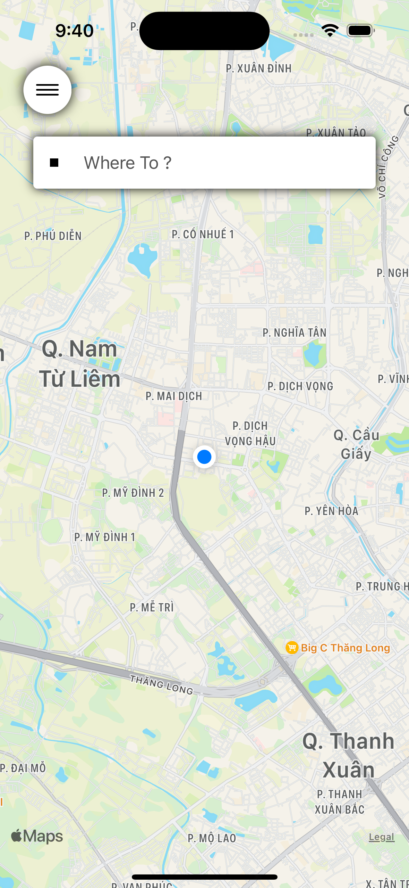
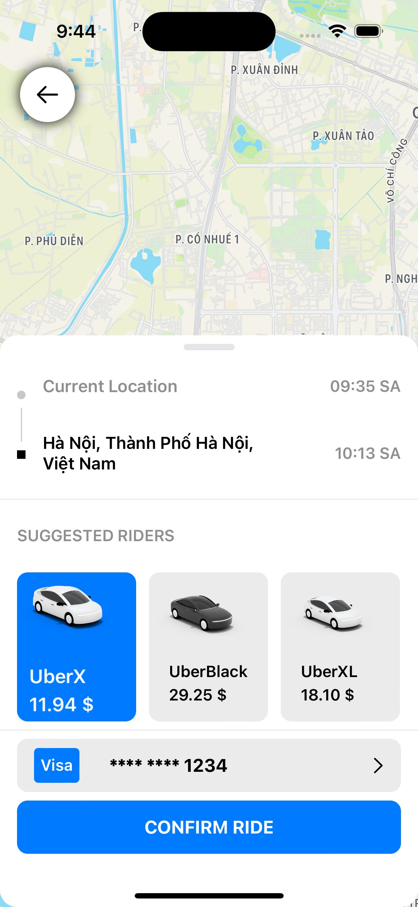
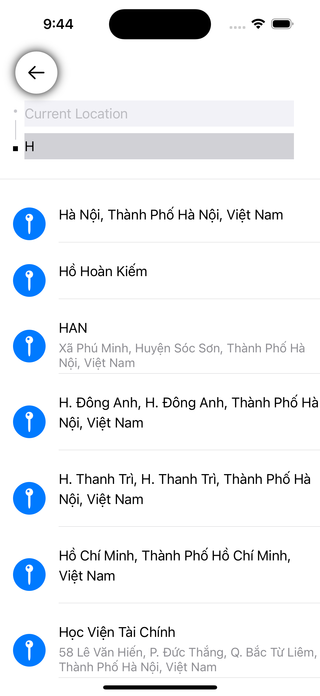

# UberClone
Feature:
- Get map from apple map
- Get the user's location
- Calculate the car fare according to the distance the user has selected
- Search location
- Search the way
- Calculate the time to get to the destination

UI/UX

Home:

Search:

After Search:

